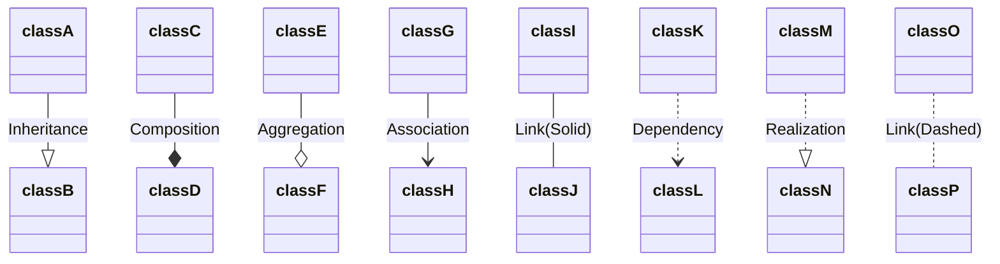

# gitcollab

## Userstory 005

[Visit google](https://www.google.com)

## User story 007
**Bold text**
*Italic text*

## User story 010
- First listitem
- Second listitem
- Third listitem


## User story 002
```java
float decimal = 0.5;
```
## User story 013

## User story 008
:two_women_holding_hands: Dreamteam! 
